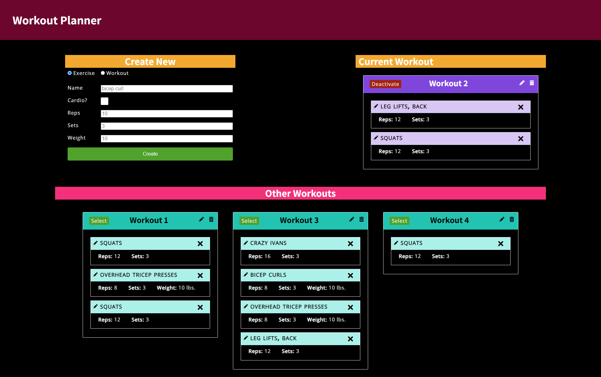

# U17 Workout Tracker
[](https://opensource.org/licenses/MIT)


## Description
Users can create exercises and workouts, and assign exercises to workouts to keep a record of their workout plans. A workout can be set to 'active' (essentially the "current" workout). Any plan can be activated, replacing the currently active workout (if there is one). Deactivating the current workout plan does not auto-activate another and a notice informs the user they can create a new workout or activate one from the list of previous workouts.

## Deployment
[Live on Heroku](https://limitless-garden-07343.herokuapp.com/)

## Table of Contents
* [Installation](#Installation)
* [Usage](#Usage)
* [Contributing](#Contributing)
* [Tests](#Tests)
* [Questions](#Questions)
* [License](#License)

screenshot.png


## Installing
- ```git clone``` to create local copy
- ```npm install``` to add required packages
- ```npm start``` or ```nodemon server.js``` to run
- visit ```localhost:8080``` to view site
- use ```localhost:8080/seed``` to add 14 exercises and 4 workouts (with randomly assigned exercises)

## Usage
Fill out the form to create a new exercise or workout. Click the pencil icon to edit the workout or exercise (the form is auto-filled with the selected info). Click the trash icon to delete the workout. Click the 'x' icon to view a modal asking if you'd like to remove the exercise from the workout, or delete the exercise. Use the 'Select' and 'Deactivate' buttons to activate/deactive a workout.

### Contributing
Fork a copy and have fun!

### Tests
none

### Questions
- Find me on Github: [skelliebunnie](https://github.com/skelliebunnie)
- Email me at: skelliebunnie@gmail.com

### License
Copyright (C) 2021 Angel

https://opensource.org/licenses/MIT

Permission is hereby granted, free of charge, to any person obtaining a copy of this software and associated documentation files (the "Software"), to deal in the Software without restriction, including without limitation the rights to use, copy, modify, merge, publish, distribute, sublicense, and/or sell copies of the Software, and to permit persons to whom the Software is furnished to do so, subject to the following conditions:

The above copyright notice and this permission notice shall be included in all copies or substantial portions of the Software.

THE SOFTWARE IS PROVIDED "AS IS", WITHOUT WARRANTY OF ANY KIND, EXPRESS OR IMPLIED, INCLUDING BUT NOT LIMITED TO THE WARRANTIES OF MERCHANTABILITY, FITNESS FOR A PARTICULAR PURPOSE AND NONINFRINGEMENT. IN NO EVENT SHALL THE AUTHORS OR COPYRIGHT HOLDERS BE LIABLE FOR ANY CLAIM, DAMAGES OR OTHER LIABILITY, WHETHER IN AN ACTION OF CONTRACT, TORT OR OTHERWISE, ARISING FROM, OUT OF OR IN CONNECTION WITH THE SOFTWARE OR THE USE OR OTHER DEALINGS IN THE SOFTWARE.
